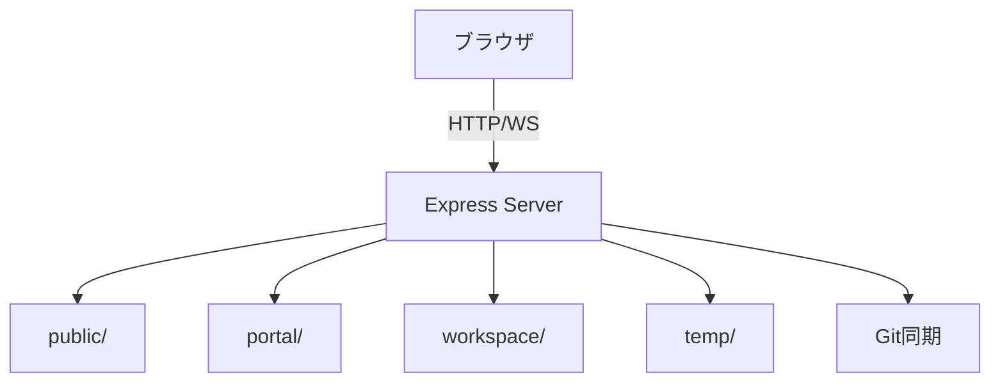

# architecture

## システム構成
- Node.js + Express サーバーが REST API / WebSocket / 静的配信を提供
- `public/` を編集画面、`portal/` をポータルとして配信
- `workspace/` は Markdown と添付ファイルの永続化領域
- `temp/` はログ・スナップショット保存領域

## セキュリティ要点
- Zod で `.env` 検証
- `validateAndResolvePath` によるディレクトリトラバーサル防止
- WebSocket はクエリ + 初回フレームの二段階トークン認証
- `Referrer-Policy: no-referrer` を常時付与
